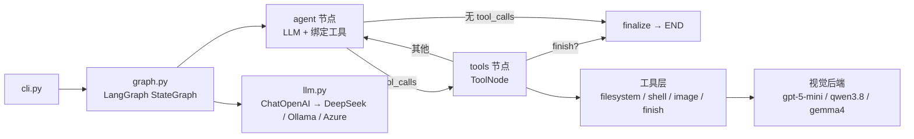

# coding-agent

一个基于 **LangGraph + DeepSeek（OpenAI 兼容接口）** 的独立 CLI coding agent（Python）。

它能：
- **阅读工程**：列出目录树、读取文件、grep / glob 搜索，真正读懂代码而不是靠猜。
- **架构分析**：自动探索工程并输出结构化的架构报告（含 Mermaid 图）。
- **代码修改**：通过精确的字符串替换 / 写文件修改代码，并可调用 Shell 验证构建与测试。
- **图片识别**：用独立的视觉模型（默认 `gpt-5-mini`）描述图片内容，支持 zip/SRDP 内嵌图片。

## 架构总览



- **主 LLM**：`langchain-openai` 的 `ChatOpenAI`，默认指向 DeepSeek `https://api.deepseek.com/v1`，模型默认 `deepseek-chat`。改用本地 Ollama 时设 `DEEPSEEK_BASE_URL=http://localhost:11434/v1`、`DEEPSEEK_MODEL=ornith-1.5:9b`；改用 Azure AI Foundry / OpenAI 时设置 `DEEPSEEK_BASE_URL` / `DEEPSEEK_MODEL` / `DEEPSEEK_API_KEY`。
- **视觉 LLM**：`describe_image` 工具独立调用视觉模型（默认 `gpt-5-mini` via Azure），与主 LLM 解耦，可单独配置。
- **编排**：`StateGraph` 循环 `agent → tools → agent`，模型调用 `finish` 工具时结束。
- **上下文管理**：按字符预算触发 LLM 摘要压缩（compact），摘要**持久化到 state**、只在新增消息再次超预算时增量追加——既防止超长任务把上下文撑爆，又避免孤立 ToolMessage 问题，同时保持请求前缀稳定以命中 provider 的 prompt cache（KV cache）。
- **安全**：路径做了 project-root 越界校验；`--read-only` 会移除所有修改类工具。

## 安装

需要 Python 3.10+。

```bash
cd coding-agent
python -m venv .venv
# Windows
.venv\Scripts\activate
# macOS / Linux
source .venv/bin/activate

pip install -e .
```

配置（复制并编辑 `.env`）：

```bash
copy .env.example .env   # Windows
cp .env.example .env     # macOS / Linux
# 编辑 .env，填入 DEEPSEEK_BASE_URL / DEEPSEEK_API_KEY / DEEPSEEK_MODEL
```

## 使用

```bash
# 1) 架构分析
coding-agent --root C:\path\to\project analyze --output report.md

# 2) 一次性任务（可改代码）
coding-agent --root . run "给 utils.py 加一个单元测试"

# 3) 交互式会话
coding-agent --root . chat

# 只读模式
coding-agent --root . --read-only analyze

# 启用图片识别（需要视觉模型支持）
coding-agent --root . --vision on run "描述 screenshot.png 里显示的错误"

# 无 DeepSeek 时，用 gpt-5-mini（Azure Foundry）作为主 LLM
coding-agent --root . --gpt5-mini run "给 utils.py 加一个单元测试"
```

### 常用参数

| 参数 | 说明 |
|------|------|
| `--root PATH` | 目标工程根目录（默认当前目录） |
| `--model ID` | 主模型 id（默认 `deepseek-chat`） |
| `--api-key KEY` | 覆盖 API key（本地 Ollama 留空） |
| `--read-only` | 只读：禁用写文件 / Shell |
| `--gpt5-mini` | 用 gpt-5-mini（Azure Foundry）作为主 LLM，替代 DeepSeek；需在 `.env` 配好 `CODING_AGENT_VISION_MODEL_URL` / `_NAME` / `_API_KEY` |
| `--iterations N` | agent 最大循环步数（默认 40；最后一步只允许 `finish`） |
| `--vision on/off/auto` | 开启图片识别工具（默认 off） |

### `run` 子命令参数（子 agent 用法）

| 参数 | 说明 |
|------|------|
| `TASK...` / `--task-file FILE` | 任务文本；`--task-file`（UTF-8，`-` 表示 stdin）适合多行/带引号/中文的任务；两者同时给出会报错（退出码 2）。单独一个 `-` 也表示读 stdin |
| `--output FILE` | 最终答案（UTF-8 markdown），**永不为空**：没有答案时写一行说明（含 stop_reason）；`--propose` 时末尾追加 `## Proposed diff` |
| `--json-result FILE` | 机器可读结果（见下），UTF-8 无 BOM；启动失败（退出码 2）时也会写 |
| `--quiet` / `-q` | 不输出实时过程，只打印一行开始信息和最后一行 `status=... stop=... tokens=... files=N`；完整过程仍在 session log |
| `--max-tokens N` | token 预算（输入+输出，默认 250000，0 = 不限）。达到 80% 后只允许 `finish`。这是**软上限**：检查发生在每次模型调用之前，最后一次调用仍可能超出（小预算下可超几十个百分点），不是硬性截断 |
| `--timeout SEC` | 墙钟预算（默认 600 秒），超时后强制收尾 |
| `--allow-write GLOB` | 可重复；只允许写/改/删/移动匹配的路径（相对 `--root`，如 `src/**/*.py`）。也可用环境变量 `CODING_AGENT_ALLOW_WRITE`（`;` 分隔）。越界时工具返回 `Error: path not allowed by --allow-write`。**设置后自动禁用 `run_shell`**（shell 不受 glob 约束）；目录不能被移动 |
| `--no-shell` | 禁用 `run_shell`（编辑工具保留；`run_diagnostics` 仍可用；只读模式下它只做内存语法检查和冲突标记扫描，不跑 ruff/mypy/git）。`--allow-write` 与 `--propose` 隐含此项 |
| `--propose` | 在 `--root` 的临时副本上运行，不改原目录，结果里带 unified diff（`.git`/`node_modules`/`__pycache__`/`.venv`/`.env*`/符号链接与 junction 不复制；自动禁用 `run_shell`；超过 50 MB 或 5000 个文件则拒绝，退出码 2）。副本里没有 `.git` |
| `--tools auto\|all\|core` | 可选工具集：`auto`（默认）按任务文本决定是否启用 SRDP/视觉工具；`all` 全开；`core` 全关 |

### 退出码

| 码 | 含义 |
|----|------|
| 0 | `finished`（调用了 `finish`）或 `soft_finished`（以纯文本给出答案但没调用 `finish`） |
| 2 | 用法/配置错误（缺任务、无 API key、`--propose` 过大等） |
| 3 | 未完成：`token_budget` / `time_budget` / `max_steps` / `stalled` / `no_final_answer`（答案可能不完整） |
| 4 | 启动之后的意外失败（异常，如 API 错误） |
| 130 | 被中断 |

### Run result JSON（`--json-result`）

```json
{
  "status": "ok | incomplete | failed",
  "stop_reason": "finished | soft_finished | token_budget | time_budget | max_steps | stalled | no_final_answer | error",
  "answer": "最终答案文本",
  "files_changed": [{"path": "src/a.py", "action": "created|modified|deleted|moved", "from": "仅 moved"}],
  "usage": {"input_tokens": 0, "output_tokens": 0, "total_tokens": 0, "llm_calls": 0, "steps": 0, "wall_seconds": 0.0},
  "model": "gpt-5-mini",
  "root": "C:\\project",
  "read_only": false,
  "session_log": "C:\\coding-agent\\logs\\session_123.log",
  "warnings": ["..."],
  "error": null,
  "diff": "仅 --propose 时出现的 unified diff"
}
```

`status` 为 `ok` 当且仅当 `stop_reason` 是 `finished` 或 `soft_finished`；`files_changed` 只统计**执行成功**的 write/edit/delete/move 调用（路径相对 `--root`，已被撤销的新建文件不计），**不含** `run_shell` 造成的改动（用过 shell 时 `warnings` 会提示）。

## 作为子 agent 使用（Using as a sub-agent）

调用方（如 Claude Code）只需看退出码和 JSON，不必解析终端输出：

```bash
# 1) 只读分析：小输入的总结 / 日志分析，不允许改动
coding-agent --root C:\proj --read-only run --quiet --json-result r.json --output r.md \
  --task-file task.md --max-tokens 100000

# 2) 受限的小改动：只能改 src 下的 .py，不允许 shell
coding-agent --root C:\proj run --quiet --json-result r.json \
  --allow-write "src/**/*.py" --no-shell "把 utils.py 里的 foo 重命名为 bar 并更新调用处"

# 3) 先看补丁再决定：在副本上改，diff 在 r.json 的 "diff" 和 r.md 的 "## Proposed diff"
coding-agent --root C:\proj run --propose --quiet --json-result r.json --output r.md \
  --task-file task.md
echo "exit=$?"   # 0 完成 / 3 未完成（看 stop_reason）/ 4 失败 / 2 用法错误
```

建议：先 `git status` 确认工作区干净，运行后用 `git diff` 复核；`--read-only` 是唯一强保证（`run_shell` 的危险命令拦截只是减速带）；备份在系统临时目录 `%TEMP%\coding-agent-bak`（不在项目内）。

## 工具清单

### 文件系统 & Shell

| 工具 | 用途 | 只读模式 |
|------|------|---------|
| `list_directory` | 列出目录树 | ✔ |
| `read_file` | 按行号读取文件 | ✔ |
| `grep_search` | 内容正则 / 子串搜索 | ✔ |
| `file_search` | 按文件名 glob 查找 | ✔ |
| `write_file` | 整体写入 / 创建文件 | ✘ |
| `edit_file` | 精确字符串替换 | ✘ |
| `delete_file` | 删除文件 | ✘ |
| `move_file` | 移动 / 重命名文件 | ✘ |
| `restore_file` | 从 git 恢复被误删文件 | ✔ |
| `run_shell` | 执行 Shell（Windows 用 PowerShell）| ✘ |
| `run_diagnostics` | 静态诊断（语法 / lint / 类型 / 合并冲突） | ✔ |
| `finish` | 标记任务完成并结束循环 | ✔ |

### SRDP / ZIP 包

| 工具 | 用途 |
|------|------|
| `srdp_list` | 列出 SRDP/ZIP 包内容 |
| `srdp_read` | 读取包内文本文件 |
| `srdp_grep` | 搜索包内文件 |
| `srdp_map_ext_content` | 映射外部内容节点 |

### 图片识别（`--vision on` 时启用）

| 工具 | 用途 |
|------|------|
| `read_image_meta` | 读取图片元数据（尺寸/格式/EXIF），不加载像素 |
| `view_image` | 将图片 base64 编码注入主 LLM 上下文（inline 视觉） |
| `describe_image` | 调用独立视觉模型生成图片文字描述（默认 `gpt-5-mini`）|
| `get_omitted_image` | 恢复因上下文压缩被省略的图片元数据 |

## 视觉配置

`describe_image` 工具使用独立的视觉模型，与主 LLM **完全解耦**，通过以下环境变量配置：

```bash
# 默认（gpt-5-mini via Azure AI Foundry，与 .env 里的主模型共用 key）
CODING_AGENT_VISION_MODEL_NAME=gpt-5-mini
# CODING_AGENT_VISION_MODEL_URL 留空 = 自动使用 DEEPSEEK_BASE_URL
# CODING_AGENT_VISION_API_KEY  留空 = 自动使用 DEEPSEEK_API_KEY

# 切换为本地 Ollama 视觉模型
CODING_AGENT_VISION_MODEL_URL=http://localhost:11434/v1
CODING_AGENT_VISION_MODEL_NAME=qwen3.8:latest
# CODING_AGENT_VISION_API_KEY 留空（Ollama 不需要）
```

### 本地视觉模型测试结果（C:/out 6 张截图）

| 模型 | 成功率 | 平均响应时间 | 备注 |
|------|--------|------------|------|
| `gpt-5-mini` (Azure) | **6/6** ✅ | ~6s | 推荐，描述精准 |
| `qwen3.8:latest` (Ollama) | **6/6** ✅ | ~75s | 本地离线备选 |
| `gemma4:12b` (Ollama) | 2/6 ⚠️ | ~20s | RGBA/大图返回空，不推荐 |

> **关键兼容性**：`gpt-5-mini` 要求请求体用 `max_completion_tokens`（不是 `max_tokens`）。
> 代码已按模型名前缀自动切换（`gpt-5-*` / `o1-*` / `o3-*` / `o4-*` → `max_completion_tokens`）。

## 目录结构

```
coding-agent/
├── pyproject.toml
├── requirements.txt
├── .env.example
├── docs/
│   └── ARCHITECTURE.md        # 内部设计文档
├── scripts/
│   ├── test_describe_image_live.py  # 视觉模型 live smoke-test
│   ├── bench_image_stat.py          # 视觉 agent 统计基准测试
│   └── visprobe.py                  # 单次视觉探测（调试用）
└── coding_agent/
    ├── cli.py          # 命令行入口（analyze / run / chat）
    ├── result.py       # 运行结果 JSON / --propose 副本与 diff / 任务输入（纯函数）
    ├── config.py       # 配置（环境变量 + CLI 覆盖）
    ├── state.py        # LangGraph 状态类型
    ├── prompts.py      # 各模式的系统提示词
    ├── llm.py          # ChatOpenAI 工厂（DeepSeek / Ollama / Azure）
    ├── graph.py        # StateGraph 编排 + 视觉后处理
    ├── compaction.py   # 上下文压缩（LLM 摘要）
    └── tools/
        ├── filesystem.py    # 目录 / 读取 / 搜索 / 写入 / 编辑
        ├── shell.py         # Shell 命令
        ├── srdp.py          # SRDP/ZIP 包读取
        ├── image_meta.py    # 图片元数据（无像素）
        ├── image_view.py    # 图片 base64 注入（inline 视觉）
        ├── describe_image.py # 视觉模型 HTTP 调用（gpt-5-mini / Ollama）
        ├── get_omitted_image.py  # 压缩图片元数据恢复
        ├── finish.py        # 完成信号
        └── __init__.py      # 工具注册（按配置过滤）
```

## 自定义

- **换主模型**：设 `.env` 里的 `DEEPSEEK_BASE_URL` / `DEEPSEEK_MODEL` / `DEEPSEEK_API_KEY`。
- **换视觉模型**：设 `CODING_AGENT_VISION_MODEL_URL` / `CODING_AGENT_VISION_MODEL_NAME`，参见上方视觉配置。
- **调整上下文预算**：`Config.context_budget_chars`（默认 50k 字符）。
- **加新工具**：在 `tools/` 下写 `@tool` 函数，加入 `tools/__init__.py` 的 `ALL_TOOLS`。

## 已知限制 / 后续方向

- `gemma4:12b` 视觉模型在 RGBA / 大图上返回空响应，待排查（可能需要强制转 RGB）。
- **执行沙箱**：`run_shell` 目前仍在**本机**运行，但已内置**灾难级命令拦截**（`rm -rf /`、`format C:`、`shutdown`、`sudo`、`mkfs`、fork bomb、`curl | sh` 等会直接拒绝）。真正的容器隔离（Docker）尚未接入；高风险场景仍建议配合容器。拦截可用 `CODING_AGENT_ALLOW_DANGEROUS=1` 关闭。
- **诊断**：尚未接入真正的 VS Code LSP 协议，但提供了 `run_diagnostics` 工具（Python 语法编译 + ruff/mypy 若已安装 + 合并冲突标记扫描 + `git diff --check`），用于按需定位编译/静态错误。
